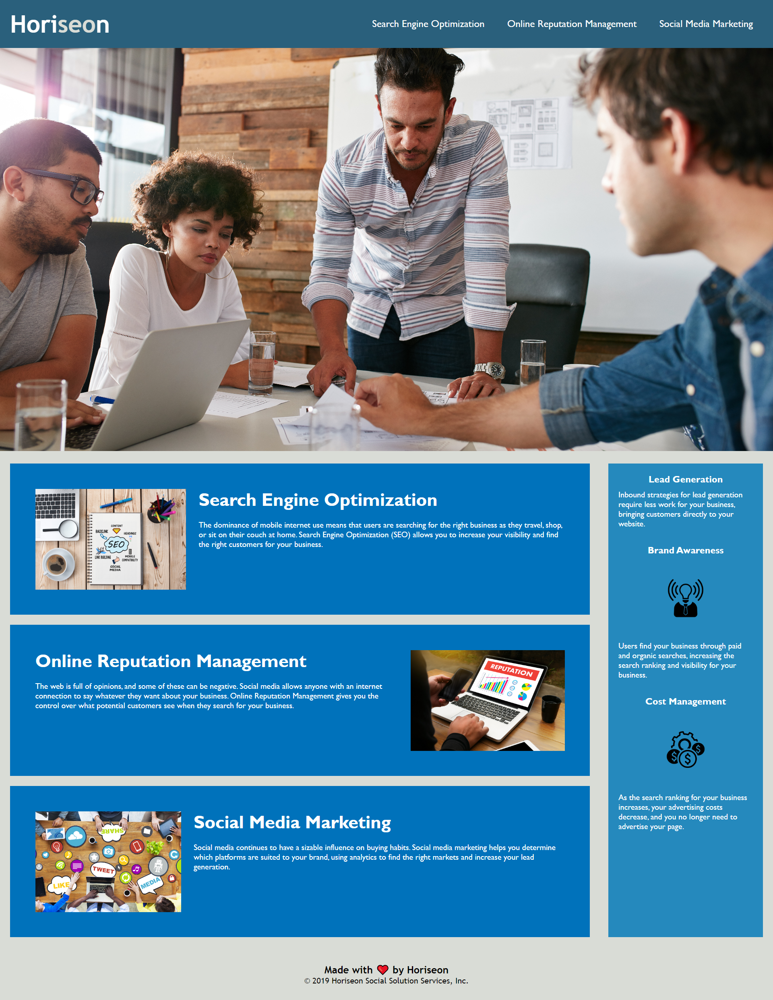

# Horiseon Refactoring

* **User Story**: 
```
AS A marketing agency
I WANT a codebase that follows accessibility standards
SO THAT our own site is optimized for search engines
```

* **Acceptance Criteria**: 
```
GIVEN a webpage meets accessibility standards
WHEN I view the source code
THEN I find semantic HTML elements
WHEN I view the structure of the HTML elements
THEN I find that the elements follow a logical structure independent of styling and positioning
WHEN I view the icon and image elements
THEN I find accessible alt attributes
WHEN I view the heading attributes
THEN they fall in sequential order
WHEN I view the title element
THEN I find a concise, descriptive title
```

## Description
This website is designed for a marketing company called Horiseon Social Solution Services, Inc. They specialize in Search Engine Optimization, Online Reputation Management, and Social Media Marketing. They also provide assistance with lead generation strategies, building your business's brand awareness through paid and organic searches, and effectively managing the cost of your advertising.

## Links
1. [Horiseon Refactoring GitHub URL](https://github.com/alkidavaci/horiseon-refactoring.git)
2. [Site is live in URL](https://alkidavaci.github.io/horiseon-refactoring/)

## Screenshots
